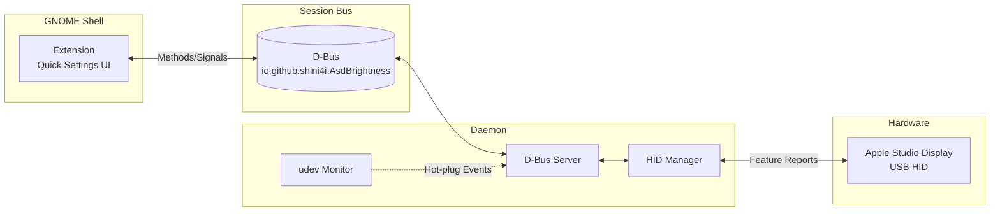

# Apple Studio Display Brightness Control for GNOME

> [!WARNING]
> **This is a Proof of Concept and is not yet ready for general use.**
>
> The project is under active development. Features may be incomplete, broken, or change without notice.

A GNOME Shell extension that integrates Apple Studio Display brightness controls into the Quick Settings panel.

## Features

- **Per-Display Controls**: Individual brightness sliders for each connected display
- **Hot-Plug Support**: Automatically detects display connect/disconnect via udev
- **D-Bus Integration**: Daemon provides a session bus service for brightness control
- **GNOME 47+ Support**: Built for modern GNOME Shell (47, 48, 49)

## Architecture



1. **Go D-Bus Daemon** (`asd-brightness-daemon`) - Communicates with display via USB HID
2. **GNOME Shell Extension** - Quick Settings UI integration

## Development

```bash
nix develop
task        # build and test
task run    # run daemon in verbose mode
```
