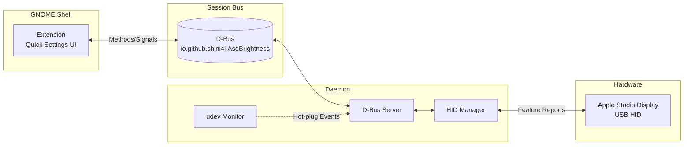

# Apple Studio Display Brightness Control for GNOME

> [!WARNING]
> **This is a Proof of Concept and is not yet ready for general use.**
>
> The project is under active development. Features may be incomplete, broken, or change without notice.

A GNOME Shell extension that integrates Apple Studio Display brightness controls into the Quick Settings panel.

<p align="center">
  
</p>

## Features

- **Per-Display Controls**: Individual brightness sliders for each connected display
- **Hot-Plug Support**: Automatically detects display connect/disconnect via udev
- **D-Bus Integration**: Daemon provides a session bus service for brightness control
- **GNOME 47+ Support**: Built for modern GNOME Shell (47, 48, 49)

## Architecture



## Requirements

- GNOME Shell 47, 48, or 49
- Apple Studio Display connected via USB-C/Thunderbolt

## Installation

### NixOS Module

Add the flake to your inputs and enable the module:

```nix
{
  inputs = {
    nixpkgs.url = "github:NixOS/nixpkgs/nixos-unstable";
    shini4i-pkgs.url = "github:shini4i/nixpkgs";
  };

  outputs = { self, nixpkgs, shini4i-pkgs, ... }: {
    nixosConfigurations.your-host = nixpkgs.lib.nixosSystem {
      system = "x86_64-linux";
      modules = [
        shini4i-pkgs.nixosModules.apple-studio-display
        {
          programs.apple-studio-display.enable = true;

          # Users must be in the "video" group to access display devices
          users.users.your-username.extraGroups = [ "video" ];
        }
      ];
    };
  };
}
```

After rebuilding your system, log out and back in. The extension will appear in GNOME Quick Settings when an Apple Studio Display is connected.

### Debian/Fedora Packages

> [!NOTE]
> The `.deb` and `.rpm` packages are experimental and have not been thoroughly tested yet.
> I would appreciate any feedback or bug reports via [GitHub Issues](https://github.com/shini4i/gnome-shell-extension-apple-studio-display/issues).

Pre-built packages are available on the [Releases](https://github.com/shini4i/gnome-shell-extension-apple-studio-display/releases) page.

**Debian/Ubuntu:**
```bash
sudo dpkg -i asd-brightness_*.deb
```

**Fedora/RHEL:**
```bash
sudo rpm -i asd-brightness-*.rpm
```

After installation, log out and back in to start the service, then enable the extension:

```bash
gnome-extensions enable asd-brightness@shini4i.github.io
```

Alternatively, use the [GNOME Extensions](https://apps.gnome.org/Extensions/) app to enable it.

## Development

This project uses Nix for reproducible development environments:

```bash
nix develop        # Enter development shell
task               # Build and test
task run           # Run daemon in verbose mode
```

### Available Task Commands

| Command | Description |
|---------|-------------|
| `task build` | Build the daemon binary |
| `task test` | Run all tests |
| `task test-race` | Run tests with race detector |
| `task lint` | Run golangci-lint |
| `task generate` | Generate mocks |
| `task coverage` | Generate HTML coverage report |
| `task run` | Run daemon in verbose mode |
